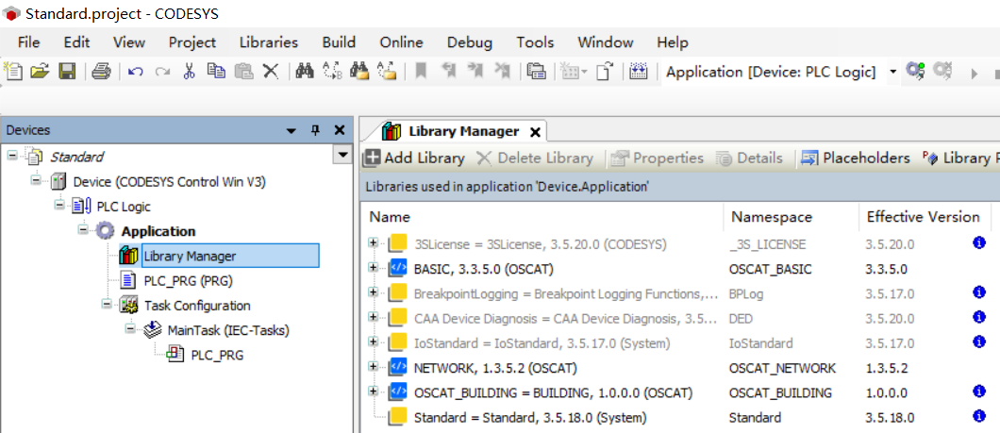

# 部署教程

## 环境配置

**CODESYS配置**

1. 推荐操作系统Windows 10及以上，测试使用的是CODESYS版本3.5.20.40(V3.5) SP20 Patch4

2. 将`HTTP_SERVER.py`文件当中CODESYS.exe路径更改为当前系统当中安装的CODESYS.exe的路径。

3. 提取模板项目。仓库提供的模板项目包含三个额外的库：OSCAT BASIC，OSCAT NETWORK，OSCAT BUILDING，如果依赖额外的库，请自行通过库管理器下载。  

> CODESYS内，File->Project Archive->Extract Archive，打开`template`目录下的`.projectarchive`进行解包  
> 选择Extract into the same folder where the archive is located，并且点击确定提取  
> 模板项目将被提取至`template`目录，保存并退出。

提取出来的模板项目如下所示，设备图标正常显示:



**Python环境配置**

在Windows下通过venv模块创建虚拟环境并且激活。

```
python -m venv ./venv
.\venv\Scripts\activate.bat
pip install -r requirements.txt

# or use uv
uv venv ./venv
.\venv\Scripts\activate.bat
uv pip install -r requirements.txt
```

## 运行

配置完成后，可直接通过`start.bat`运行服务端和客户端。`start.bat`是启动脚本，主要做了以下事情：

**服务端**

通过管理员权限启动的Command Prompt终端运行debug server。

```
python debug_server.py
```

此时程序输出部署的服务地址，包括局域网内IP地址与端口号，并且会保持占用当前终端。

如果程序运行后直接无输出退出或者无反应，请查看同级目录下的日志文件`codesys_api_server.log`检查错误原因。

部署的IP地址和端口号默认是当前网卡地址+9000，支持修改，位于`HTTP_SERVER.py`文件中。

**初始化客户端**

服务端成功运行后，需要启动一个客户端example client调用部分服务接口进行初始化，完成session的创建与测试项目的创建。

如果有需要，可以集成当中的初始化函数到自己的项目。

example client会从debug server日志当中获取其请求IP地址和端口。

```
python example_client.py
```

运行example client时，初始化操作会拉起CODESYS的GUI界面，需要手动点击“继续”按钮，才能进行后续操作。

等待初始化的完成，当example client输出类似以下信息时，成功完成初始化。

```
2025-05-27 21:47:12,002 - codesys_api_client - INFO - Project created successfully
2025-05-27 21:47:12,002 - codesys_api_client - INFO - Actual project path: E:\Openness\CODESYSCompileAPI\projects\CODESYS_Test_Project.project
2025-05-27 21:47:12,002 - codesys_api_client - INFO - Project file verified to exist on disk
Press enter to start example workflow or Ctrl+C to exit...
```

此时`codesys_api_server.log`最后几行内容类似于：

```
2025-05-27 21:47:11,796 - codesys_api_server - INFO - Result file found after 3.22 seconds (33 checks)
2025-05-27 21:47:11,997 - codesys_api_server - INFO - Script execution successful
2025-05-27 21:47:11,997 - codesys_api_server - INFO - Script execution result: {'executed_by': 'CODESYS PersistentSession', 'project': {'dirty': False, 'name': 'CODESYS_Test_Project.project', 'path': 'E:\\Openness\\CODESYSCompileAPI\\projects\\CODESYS_Test_Project.project'}, 'request_id': 'f78e2e09-613f-4f8d-87a8-caac3ecf4913', 'execution_time': 1748353631.7139053, 'success': True}
2025-05-27 21:47:11,997 - codesys_api_server - INFO - Project creation successful
```

# 致谢

本项目参考以下项目完成。

[codesys-api by claude](https://github.com/johannesPettersson80/codesys-api)

值得注意的是，该项目作者使用Claude进行编码，我们在CODESYS上测试并且修复了许多不能使用的地方，改进了核心的工作模式以确保支持至少4-5个并发访问。
